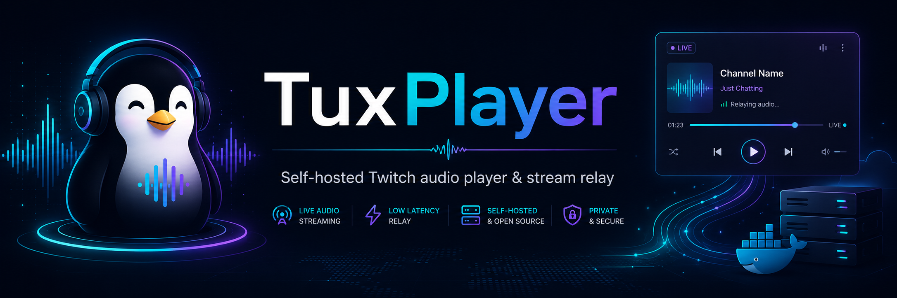

# TuxPlayer

TuxPlayer provides one permanent MP3 stream for Twitch audio, so Music Assistant only needs a single stable URL:

`http://192.168.2.124:8766/stream/`

If no channel is selected, the selected channel is offline, or Streamlink/FFmpeg fails, TuxPlayer serves silence instead of returning `404`. The project is designed for local Docker deployment with a simple admin UI.

## Overview

Audio flow:

`Twitch -> Streamlink -> FFmpeg decode -> TuxPlayer PCM/MP3 pipeline -> /stream/ -> Music Assistant`

Only one Twitch source is active at a time, while all listeners share the same output stream.

## Features

- Permanent `/stream/` endpoint with `audio/mpeg`
- Silence fallback instead of `404`
- One shared Streamlink/FFmpeg pipeline for all listeners
- Idle timeout that stops the Twitch source when nobody is listening
- SQLite storage for channels and settings in `./data/tuxplayer.db`
- Danish admin UI with large touch-friendly controls
- Volume slider in the UI
- Optional Twitch API integration via `TWITCH_CLIENT_ID` and `TWITCH_CLIENT_SECRET`
- Optional HTTP Basic Auth for the UI and mutating API endpoints

## Requirements

- Docker
- Docker Compose
- A host where `network_mode: bridge` is allowed

## Quick Start

```bash
cd /docker_data/tuxplayer
cp .env.example .env
nano .env
docker compose up -d --build
```

## Access

- UI: [http://192.168.2.124:8766](http://192.168.2.124:8766)
- Health endpoint: `http://192.168.2.124:8766/health`
- Status API: `http://192.168.2.124:8766/api/status`
- Permanent stream: `http://192.168.2.124:8766/stream/`

## Music Assistant

Add only this single URL:

`http://192.168.2.124:8766/stream/`

You do not need one URL per DJ or channel.

## Configuration

The project uses `.env`. Start from `.env.example`.

Important variables:

- `TZ=Europe/Copenhagen`
- `PUBLIC_BASE_URL=http://192.168.2.124:8766`
- `STREAM_IDLE_TIMEOUT=30`
- `STREAM_BITRATE=160k`
- `STREAM_SAMPLE_RATE=44100`
- `STREAM_VOLUME=1.8`
- `STREAM_CHUNK_MS=50`
- `SUBSCRIBER_QUEUE_SIZE=24`
- `STREAMLINK_LIVE_EDGE=3`
- `STREAMLINK_QUALITY=best`
- `TWITCH_CLIENT_ID=`
- `TWITCH_CLIENT_SECRET=`
- `ADMIN_USERNAME=`
- `ADMIN_PASSWORD=`
- `LOG_LEVEL=INFO`

## Twitch API Credentials

If `TWITCH_CLIENT_ID` and `TWITCH_CLIENT_SECRET` are set, TuxPlayer uses the Twitch API for live status, title, viewer count, and profile image data.

If they are empty, the system still works, but the UI will typically show `unknown` until playback is attempted or Streamlink returns an error.

## Audio and Tuning

Volume can be adjusted directly in the UI using the built-in slider.

If you want to tune behavior manually in `.env`, the most relevant values are:

- `STREAM_VOLUME=1.8` for overall loudness
- `STREAM_CHUNK_MS=50` for pipeline chunk size
- `SUBSCRIBER_QUEUE_SIZE=24` for client buffering
- `STREAMLINK_LIVE_EDGE=3` for the stability/latency balance
- `STREAMLINK_QUALITY=best` for a more compatible Twitch source selection

## API Endpoints

- `GET /` admin panel
- `GET /stream/` permanent MP3 stream
- `GET /stream` redirect to `/stream/`
- `GET /health` healthcheck
- `GET /api/status` stream and source status
- `GET /api/channels` list channels
- `POST /api/channels` create channel
- `PUT/PATCH /api/channels/<id>` update channel
- `DELETE /api/channels/<id>` delete channel
- `POST /api/channels/<id>/select` select active channel
- `POST /api/channels/<id>/favorite` toggle favorite status
- `POST /api/channels/<id>/test` test channel
- `POST /api/stream/stop` stop the Twitch source
- `POST /api/stream/restart` restart the Twitch source
- `GET /api/logs` read recent application logs

## Testing

Local checks:

```bash
pytest
docker compose config
docker compose build
```

Simple runtime checks:

```bash
curl http://127.0.0.1:8766/health
curl http://127.0.0.1:8766/api/status
```

## Troubleshooting

```bash
docker compose ps
docker compose logs -f
docker stats tuxplayer
```

Common things to verify:

- the selected Twitch channel is actually live
- `streamlink` can open the channel from the server
- `PUBLIC_BASE_URL` points to the correct host and port
- `.env` tuning values are not too aggressive

## Backup

The database is stored in:

`./data/tuxplayer.db`

Back up that file if you want to preserve channels and settings.

## Update and Rebuild

```bash
docker compose down
docker compose build --no-cache
docker compose up -d
```

## Repository Notes

- `.env` is ignored
- SQLite database files in `data/` are ignored
- local Codex/test artifacts are ignored
- `app/static/banner.png` is used at the top of this README and in the web UI

## Project Structure

```text
tuxplayer/
├── app/
│   ├── static/
│   └── templates/
├── data/
├── tests/
├── .dockerignore
├── .env.example
├── .gitignore
├── docker-compose.yml
├── Dockerfile
├── README.md
└── requirements.txt
```
